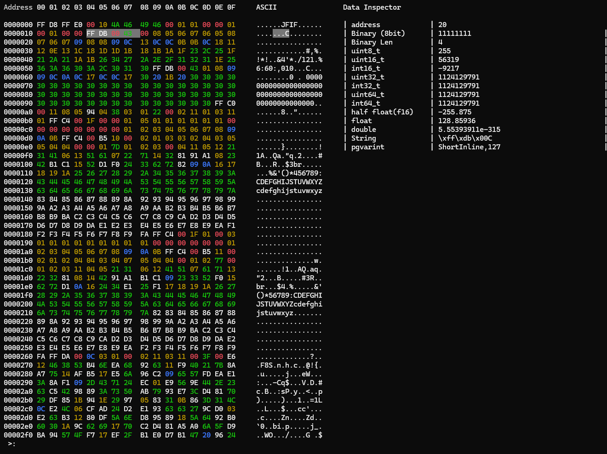

# Chappie
Hex cli tool

# Get start
```
$ chap filename
```
## 1. Hex Editing Mode
Hex Editing Mode enables users to:
View and modify the raw byte-level content of files
Edit both hexadecimal values and corresponding ASCII characters
Analyze binary structures such as headers or firmware dumps
Ensure byte-level accuracy for debugging, reverse engineering, or file repair
Useful for database, developers, reverse engineers, and digital forensics experts.



## Keybindings

|Key|function|
|----|-------|
|Up|   move to the previous line|
|Down| move to the next line|
|Left| move to the left byte|
|Right| move to the right byte|
|Ctrl-c| exit|
|Ctrl-Up| select the previous line|
|Ctrl-Down| select the next line|
|Ctrl-Left| select the byte on the left|
|Ctrl-Right| select the byte on the right|
|j \<Address\>| jump to address|
|f \<String or hex code\> |find String or hex code|
|cut \<Start\> \<End\> \<Filepath\>| Screenshot bytecode to save to file|
|lf|List the available plugins name that are used to parse binaries|
|call \<plugin name\>| Calling plugins parsing binaries|
```
