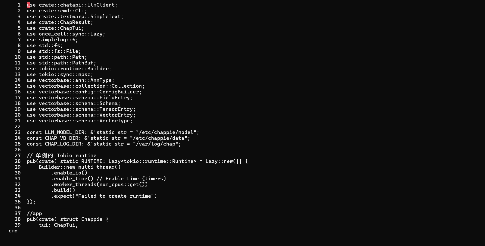
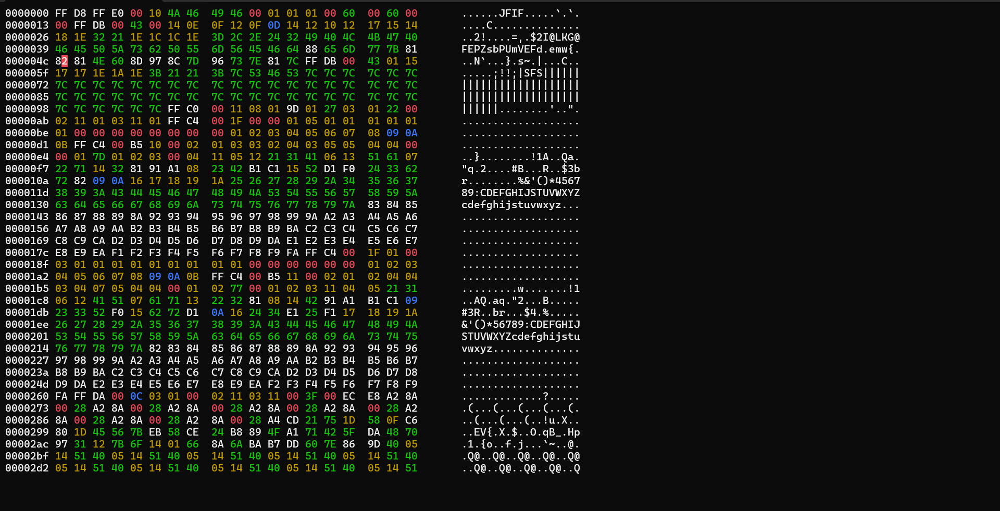

# Chappie
Text cli tool, with integrated Vector database and AI

# Get start
```
$ chap filename
```

### 1. Text Editing Mode
In Text Editing Mode, users can:

Open and edit plain text files (e.g., .txt, .md, .log, etc.)
Use standard editing features such as cut, copy, paste, undo, redo, find & replace
Support syntax highlighting for programming and markup languages
Save and export edited content in various formats
This mode is ideal for general-purpose writing, code editing, and note-taking.



### 2. Hex Editing Mode
Hex Editing Mode enables users to:
View and modify the raw byte-level content of files
Edit both hexadecimal values and corresponding ASCII characters
Analyze binary structures such as headers or firmware dumps
Ensure byte-level accuracy for debugging, reverse engineering, or file repair
Useful for developers, reverse engineers, and digital forensics experts.



### 3. Large File Viewing Mode
Designed for efficient navigation of very large files, this mode provides:
Optimized performance for opening multi-GB files without loading them entirely into memory
Chunked reading with on-demand rendering
Line-by-line or paginated browsing
Search functionality over partial or streamed content
Perfect for viewing log files, datasets, or system outputs that are too large for typical editors.

### 4. RAG Mode (Retrieval-Augmented Generation)
RAG Mode leverages AI to enable:
Context-aware question answering based on local documents
Retrieval of relevant text snippets from files or knowledge bases
Integration with LLMs to generate accurate, grounded responses
Customizable sources and vector indexing support

Ideal for building intelligent document assistants, chatbots, or research tools that combine search with generative AI.

### 5. Multimedia-to-Text Mode
Multimedia-to-Text Mode automatically converts image, audio, and video content into readable text. It supports:
OCR (Optical Character Recognition) to extract text from images (eg, scanned documents, screenshots)
Audio transcription to convert speech into written text (eg, interviews, podcasts)
Video transcription with optional timestamped captions
Multilingual support and speaker diarization (depending on configuration)
Ideal for media archiving, content analysis, accessibility, and note-taking from non-text sources.